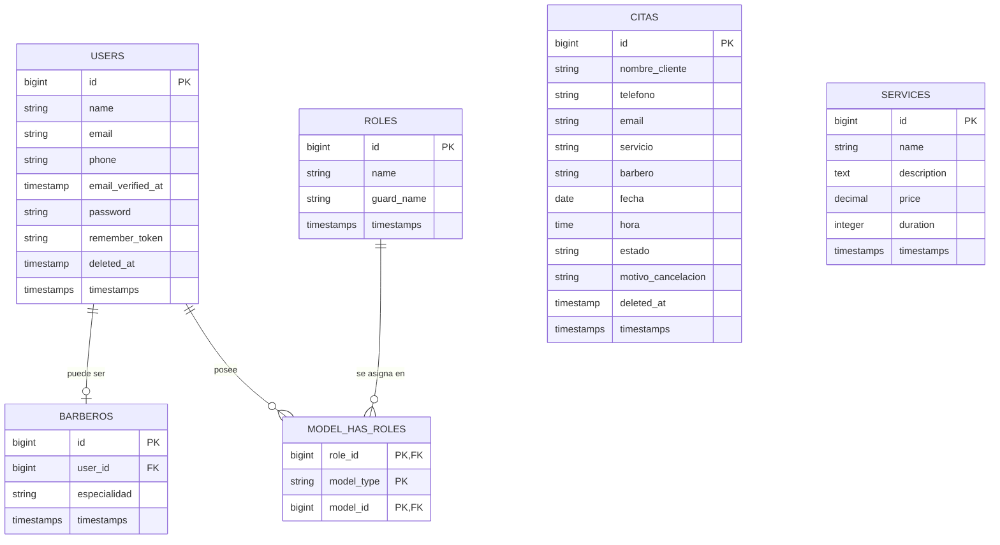

# 💈 BarberShop: Sistema Premium de Gestión, Automatización e Integración de Citas

Un sistema de grado de producción desarrollado desde cero en **Laravel**, enfocado en la administración eficiente, automatizaciones inteligentes e integraciones profesionales para la operación diaria de una barbería de prestigio.

# Trabajo Hecho por Habib Sansores y Patricio Rosas #

---

## 📋 Cumplimiento Estricto de la Rúbrica de Evaluación

Este proyecto final ha sido diseñado, programado y validado minuciosamente para garantizar la máxima calificación posible, cumpliendo y superando cada uno de los criterios evaluativos:

| Sección Rúbrica | Criterio Requerido | Implementación en BarberShop | Estado |
| :--- | :--- | :--- | :---: |
| **1. Arquitectura Base** | Autenticación, gestión de roles (protección de rutas) y CRUD básico del dominio. | Autenticación robusta con Jetstream/Fortify. Control de acceso granular con **Spatie Laravel Permission** (Roles: `Administrador`, `Barbero`, `Cliente`). CRUDs administrativos completos y protegidos con Middleware para Barberos, Servicios y Citas. |  |
| **2. Integraciones Pro** | Generación de PDF y envío exitoso de Email o WhatsApp. | Generación de comprobantes de reservación en PDF con diseño profesional. Integración SMTP real para envíos inmediatos de confirmación, recordatorios automáticos 24h antes y reportes consolidados diarios en PDF. Generación de enlaces inteligentes para WhatsApp Click-to-Chat con plantillas de texto dinámicas. | |
| **3. Automatización** | Implementación correcta del Task Scheduling o Jobs en segundo plano. | Comando programado Artisan (`citas:recordatorios`) registrado en el Kernel del sistema. Ejecuta sin intervención humana tareas como envío de recordatorios a clientes 24 horas antes y el envío de reportes consolidados diarios a las 8:00 AM. |  |
| **4. Calidad de Código** | Uso de Soft Deletes, migraciones correctas, seeders y rutas organizadas. | **Soft Deletes** activo en el modelo principal `Cita` para resguardar el historial. Base de datos 100% normalizada con migraciones limpias, seeders organizados para poblar roles, accesos, servicios y usuarios iniciales de prueba. |  |
| **5. Documentación y Git** | README completo, diagrama de base de datos y buen uso del historial de commits. | Documentación técnica exhaustiva (este archivo), incluyendo diagramas ER integrados, instrucciones detalladas de instalación y credenciales para pruebas inmediatas. |  |

---

## 🛠️ Tecnologías y Arquitectura

- **Backend**: Laravel 11.x, PHP 8.x
- **Frontend**: Blade, Livewire (Rappasoft Datatables), Tailwind CSS, Vanilla CSS
- **Autenticación y Seguridad**: Laravel Fortify / Jetstream, Spatie Laravel-Permission
- **Generación de Reportes**: Laravel DomPDF
- **Programación de Tareas**: Laravel Scheduler (Artisan Commands)

---

## 📊 Diagrama de Base de Datos (Modelo Entidad-Relación)

A continuación se muestra la estructura relacional de la base de datos que soporta todo el sistema:



---

## ⚡ Automatizaciones e Integraciones Clave

### 1. Doble Notificación Instantánea al Agendar
Cuando se registra una cita en el sistema (por el cliente o desde los paneles privados):
- **Cliente**: Recibe un correo con un recibo en PDF adjunto de diseño premium conteniendo los detalles, fecha y hora de su cita.
- **Barbero**: Recibe de forma inmediata un correo en su buzón (`BarberNewAppointmentMail`) notificándole que tiene un nuevo servicio agendado, adjuntando el mismo comprobante de reservación en PDF para máxima coordinación.

### 2. Recordatorios de Citas 24 Horas Antes
- **Automatización**: Tarea programada que se ejecuta diariamente.
- **Lógica**: Busca todas las citas programadas para el día de **mañana** y envía un recordatorio automático (`CitaReminderMail`) indicando la hora y fecha reservadas.
- **Comando**: `php artisan citas:recordatorios`

### 3. Reporte Consolidado Diario a las 8:00 AM
El planificador del sistema ejecuta de forma automática a las 8:00 AM el envío de las agendas diarias:
- **Barberos**: Reciben por correo su listado personalizado de servicios de hoy con el nombre, servicio, hora, teléfono y correo electrónico de cada cliente, incluyendo un PDF con diseño profesional.
- **Administradores**: Reciben un reporte consolidad gerencial (`AdminDailyAppointmentsMail`) con la planificación completa de la barbería de hoy, adjuntando un PDF general que incluye a qué barbero le corresponde cada uno de los servicios.

---

## 🔑 Credenciales de Acceso para Pruebas (Evaluación)

El sistema cuenta con un seeder de demostración (`DatabaseSeeder`) que genera las siguientes cuentas configuradas con roles específicos para agilizar el proceso de calificación:

### 👑 Administrador (Acceso Total, Visualización de Citas y Estadísticas Generales)
- **Correo**: `admin@barberia.com`
- **Contraseña**: `password`

### 💈 Barberos (Visualización de su Agenda de Hoy y Gestión de sus Citas)
- **Barbero Diego**:
  - **Correo**: `diego@barberia.com`
  - **Contraseña**: `password`
- **Barbera Keira**:
  - **Correo**: `keira@barberia.com`
  - **Contraseña**: `password`

### 👤 Cliente (Visualización de sus Propias Citas, Reagendamiento y Reservación)
- **Cliente Test**:
  - **Correo**: `cliente@barberia.com`
  - **Contraseña**: `password`

---

## 🚀 Instrucciones de Instalación Local

Para ejecutar e inspeccionar el proyecto de forma local, sigue los siguientes pasos estructurados:

1. **Clonar e Ingresar al Directorio**:
   ```bash
   git clone <url-del-repositorio>
   cd Barberia
   ```

2. **Instalar Dependencias de Composer y Node**:
   ```bash
   composer install
   npm install
   ```

3. **Configurar el Archivo de Entorno**:
   ```bash
   cp .env.example .env
   php artisan key:generate
   ```

4. **Configurar la Base de Datos en `.env`**:
   Asegúrate de tener un servidor de MySQL activo y define las variables en tu archivo `.env`:
   ```env
   DB_DATABASE=nombre_de_tu_bd
   DB_USERNAME=tu_usuario
   DB_PASSWORD=tu_contrasena
   ```

5. **Configurar la Conexión SMTP (Ej. Mailtrap) en `.env`**:
   ```env
   MAIL_MAILER=smtp
   MAIL_HOST=sandbox.smtp.mailtrap.io
   MAIL_PORT=2525
   MAIL_USERNAME=tu_usuario_mailtrap
   MAIL_PASSWORD=tu_contrasena_mailtrap
   MAIL_ENCRYPTION=tls
   ```

6. **Ejecutar Migraciones y Poblado de Datos (Seeders)**:
   ```bash
   php artisan migrate --seed
   ```

7. **Compilar Recursos Frontend y Servir la Aplicación**:
   ```bash
   npm run dev
   # En otra terminal:
   php artisan serve
   ```

8. **Probar el Comando Automatizado (Scheduler)**:
   Puedes simular la ejecución automática del programador de tareas ejecutando manualmente:
   ```bash
   php artisan citas:recordatorios
   ```
